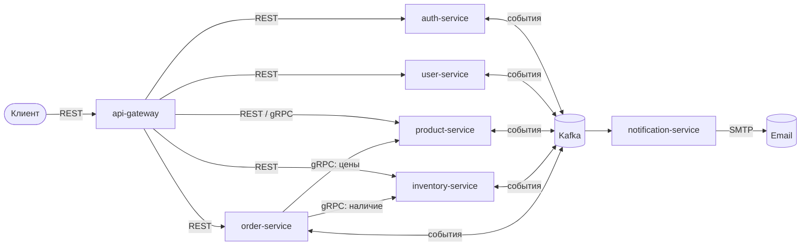
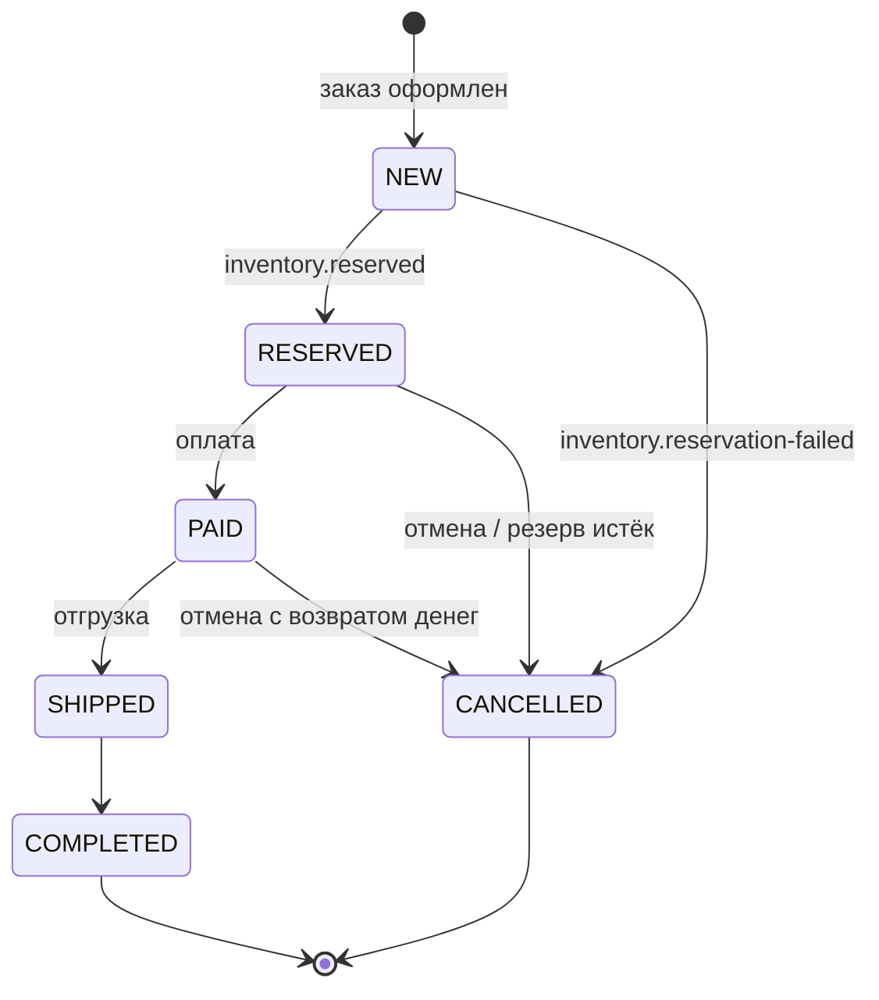

# Event-Driven Order Processing Platform

Платформа обработки заказов для небольшого e-commerce-магазина: каталог товаров,
пользователи и роли, оформление заказов, учёт запасов и уведомления.

Система состоит из микросервисов на Python (FastAPI, async). Сервисы общаются
асинхронно через Kafka и синхронно через REST/gRPC. Заказ проходит путь
от оформления до доставки как **сага на хореографии**: каждый сервис реагирует
на события других и при сбое публикует компенсирующие события.

> **Статус:** готовы каркас платформы и локальный стенд. Все сервисы
> собираются, запускаются и отвечают на health-check. Бизнес-логику сервисов
> добавляем по плану ниже, см. раздел [Дорожная карта](#дорожная-карта).

---

## Содержание

- [Архитектура](#архитектура)
- [Стек](#стек)
- [Структура репозитория](#структура-репозитория)
- [Быстрый старт](#быстрый-старт)
- [Как пользоваться стендом](#как-пользоваться-стендом)
- [Разработка](#разработка)
- [Правила кода](#правила-кода)
- [Дорожная карта](#дорожная-карта)
- [Решение проблем](#решение-проблем)

---

## Архитектура



### Сервисы

| Сервис | Назначение | Хранилище | Протоколы |
|--------|-----------|-----------|-----------|
| `api-gateway` | Единая точка входа, проверка JWT, маршрутизация, rate-limiting | Redis | REST, gRPC |
| `auth-service` | Регистрация, подтверждение email, JWT access + refresh | PostgreSQL | REST |
| `user-service` | Профили пользователей, роли (`ROLE_USER`, `ROLE_MANAGER`, `ROLE_ADMIN`) | PostgreSQL | REST, Kafka |
| `product-service` | Каталог: CRUD, публикация, поиск и фильтры | MongoDB | REST, gRPC, Kafka |
| `inventory-service` | Остатки и резервы товаров | PostgreSQL | gRPC, Kafka |
| `order-service` | Заказы и их жизненный цикл | PostgreSQL | REST, gRPC, Kafka |
| `notification-service` | Письма о статусах заказа, rate-limit по пользователю | MongoDB, Redis | Kafka |

### Жизненный цикл заказа



### События Kafka

| Топик | Ключ | Публикует | Читают |
|-------|------|-----------|--------|
| `user.created` | user_id | auth-service | user-service, notification-service |
| `user.verification-requested` | user_id | auth-service | notification-service |
| `user.roles-changed` | user_id | user-service | auth-service |
| `product.changed` | product_id | product-service | inventory-service |
| `order.created` | order_id | order-service | inventory-service, notification-service |
| `inventory.reserved` | order_id | inventory-service | order-service |
| `inventory.reservation-failed` | order_id | inventory-service | order-service |
| `inventory.released` | order_id | inventory-service | order-service |
| `order.status-changed` | order_id | order-service | inventory-service, notification-service |

У каждого топика есть очередь ошибок `<топик>.dlq`: туда попадают сообщения,
которые не удалось обработать после повторных попыток. Схемы событий — это
Pydantic-модели в `libs/events`. Из них генерируется JSON Schema, которая
регистрируется в Schema Registry с режимом совместимости `BACKWARD`.

---

## Стек

| Область | Технологии |
|---------|-----------|
| Язык и веб | Python 3.12, FastAPI, Pydantic v2, pydantic-settings, Uvicorn |
| Базы данных | PostgreSQL 16 (SQLAlchemy 2 async + asyncpg, Alembic), MongoDB 7 (Motor), Redis 7 (redis.asyncio) |
| Обмен сообщениями | Apache Kafka (KRaft), Confluent Schema Registry, confluent-kafka |
| Синхронные вызовы | REST (httpx), gRPC (grpcio) |
| Зависимости | uv (workspace, единый `uv.lock`) |
| Качество | ruff (линтер и форматирование), mypy (strict), import-linter, pytest + pytest-asyncio, pytest-cov |
| Инфраструктура | Docker, docker-compose, Kubernetes (k3d), Helm |
| Почта (локально) | Mailpit |

---

## Структура репозитория

```
.
├── pyproject.toml              # корень uv workspace + настройки ruff и mypy
├── uv.lock                     # единый lock-файл зависимостей
├── Makefile                    # все рабочие команды (make help)
├── docker-compose.yml          # локальный стенд
├── scripts/                    # все скрипты проекта
│   ├── doctor.sh               #   проверка окружения разработчика
│   ├── dev-up.ps1 / dev-down.ps1  # запуск стенда из PowerShell
│   ├── postgres-init-databases.sh # создание БД и ролей сервисов
│   └── kafka-create-topics.sh  #   создание топиков и DLQ
├── libs/
│   ├── events/                 # контракт событий Kafka (Pydantic-модели)
│   └── platform/               # общие механизмы: health-check, настройки, outbox, consumer
└── <service>/                  # auth-service, user-service, product-service,
    ├── pyproject.toml          # inventory-service, order-service,
    ├── Dockerfile              # notification-service, api-gateway
    ├── src/
    │   ├── main.py             # фабрика FastAPI-приложения
    │   ├── config.py           # настройки из переменных окружения
    │   ├── api/                # только HTTP: роуты, схемы запросов и ответов
    │   ├── services/           # бизнес-сценарии, транзакции
    │   ├── domain/             # чистые модели и правила, без I/O
    │   └── repositories/       # доступ к базе данных
    └── tests/
        ├── unit/
        └── integration/
```

Код сервиса лежит прямо в `<service>/src/` и импортируется как `src.*`.
Каждый сервис входит в uv workspace как «виртуальный» участник: uv ставит его
зависимости, а сам код не ставится пакетом. Библиотеки из `libs/` устанавливаются
как пакеты `events` и `platform_lib`.

---

## Быстрый старт

### 1. Что нужно установить

| Инструмент | Версия | Зачем |
|-----------|--------|-------|
| [uv](https://docs.astral.sh/uv/) | ≥ 0.5 | Python и зависимости |
| Docker Desktop / OrbStack / Colima | Engine ≥ 25, Compose v2 | локальный стенд |
| GNU Make | ≥ 3.81 | команды проекта |
| git | ≥ 2.40 | — |
| k3d, kubectl, helm, kubeseal | актуальные | локальный Kubernetes (нужны позже) |
| trivy, grpcurl | актуальные | сканирование образов, ручная проверка gRPC |

**macOS:**

```bash
xcode-select --install                                   # make, git
brew install uv k3d kubectl helm kubeseal trivy grpcurl
brew install --cask docker                               # или: brew install orbstack
uv python install 3.12
```

**Windows 10/11:** Docker Desktop с бэкендом WSL2. Дальше всё делается внутри
WSL2 (Ubuntu) так же, как в Linux. Для PowerShell есть скрипты `scripts/dev-up.ps1`
и `scripts/dev-down.ps1`.

**Linux / WSL2:**

```bash
curl -LsSf https://astral.sh/uv/install.sh | sh
uv python install 3.12
# k3d, kubectl, helm, kubeseal, trivy — по официальным инструкциям
```

Ресурсы: для стенда без observability хватает 2 CPU и 8 GB RAM, сам стенд
занимает около 1 GB.

### 2. Установка проекта

```bash
git clone <url-репозитория> event-driven-orders-platform
cd event-driven-orders-platform

make doctor     # проверит, что все инструменты на месте и Docker запущен
make install    # uv sync --all-packages: все сервисы и библиотеки в одном .venv
```

### 3. Запуск стенда

```bash
make dev-up
```

Одна команда собирает образы, поднимает инфраструктуру, создаёт базы данных и
топики, запускает все сервисы и ждёт, пока они станут healthy. Обычно это
занимает около 30 секунд, при первом запуске дольше из-за скачивания образов.

Из PowerShell:

```powershell
./scripts/dev-up.ps1
```

Файл `.env` для запуска **не нужен**: у всех переменных в `docker-compose.yml`
есть значения по умолчанию для локальной разработки. Если нужно что-то
переопределить, например порт, который уже занят, создайте `.env` в корне:

```dotenv
GATEWAY_HOST_PORT=8080
POSTGRES_HOST_PORT=15432
```

`.env` в git не попадает.

### 4. Остановка

```bash
make dev-down     # остановить, данные в томах сохраняются
make dev-reset    # остановить и удалить все данные
```

---

## Как пользоваться стендом

### Адреса

| Что | Адрес |
|-----|-------|
| API gateway | http://localhost:8000 |
| Swagger UI | http://localhost:8000/docs |
| Mailpit (письма) | http://localhost:8025 |
| Schema Registry | http://localhost:8081 |
| Kafka (с хоста) | `localhost:9094` |
| PostgreSQL | `localhost:5432`, пользователь `postgres` |
| MongoDB | `mongodb://localhost:27017/?directConnection=true` |
| Redis | `localhost:6379` |
| Kafka UI (по желанию) | http://localhost:8088 — `docker compose --profile tools up -d kafka-ui` |

Инфраструктура слушает только `127.0.0.1`. Наружу из сервисов опубликован
только api-gateway, остальные доступны внутри docker-сети по имени сервиса
(`order-service:8005` и т. п.).

### Проверка, что всё работает

```bash
curl localhost:8000/health/live    # {"status":"ok"} — процесс жив
curl localhost:8000/health/ready   # проверка зависимостей; 503, если какая-то недоступна
make dev-ps                        # состояние всех контейнеров
make dev-logs                      # логи всех сервисов
docker compose logs -f order-service   # логи одного сервиса
```

### Kafka

```bash
# список топиков
docker compose exec kafka /opt/kafka/bin/kafka-topics.sh \
  --bootstrap-server localhost:9092 --list

# читать события топика
docker compose exec kafka /opt/kafka/bin/kafka-console-consumer.sh \
  --bootstrap-server localhost:9092 --topic order.created --from-beginning
```

### Базы данных

У каждого PostgreSQL-сервиса своя база и своя роль: `auth`, `users`, `inventory`,
`orders`. Пароли по умолчанию заданы в `docker-compose.yml`.

```bash
docker compose exec postgres psql -U postgres -d orders
docker compose exec mongo mongosh catalog
```

---

## Разработка

### Команды

```bash
make help              # список всех команд
make lint              # ruff check + проверка формата + правила слоёв (import-linter)
make format            # автоисправление и форматирование
make typecheck         # mypy (strict) по каждому пакету
make test              # unit-тесты всех пакетов
make test-integration  # интеграционные тесты (нужен Docker)
```

Работа с одним сервисом:

```bash
cd order-service
uv run pytest -q                                  # тесты с покрытием
uv run uvicorn src.main:app --reload --port 8005  # запуск без Docker
uv run lint-imports                               # правила слоёв сервиса
```

### Зависимости

Зависимость добавляется в нужный пакет, lock-файл общий:

```bash
cd order-service && uv add sqlalchemy        # зависимость сервиса
uv add --dev <пакет>                         # инструмент разработки (из корня)
```

`uv.lock` руками не редактируется, только через `uv add` / `uv lock`.

### Новый сервис

1. Скопируйте структуру существующего сервиса: `pyproject.toml`, `Dockerfile`,
   `src/`, `tests/`.
2. Добавьте сервис в `SERVICES` в `Makefile` и в `docker-compose.yml`.
3. Если сервису нужна своя база PostgreSQL, добавьте её в
   `scripts/postgres-init-databases.sh`.

### Docker-образы

Образы собираются из корня репозитория, потому что им нужны `libs/` и `uv.lock`:

```bash
docker build -f order-service/Dockerfile -t orders/order-service:dev .
```

Образ двухстадийный: зависимости ставятся через `uv sync --frozen --no-dev`,
процесс запускается под непривилегированным пользователем, у образа есть
`HEALTHCHECK`.

---

## Правила кода

- **Слои.** `api/` отвечает только за HTTP, вся логика живёт в `services/`,
  доступ к БД — в `repositories/`, а `domain/` не зависит от I/O. Правила
  проверяет import-linter в `make lint`.
- **Деньги.** Только `Decimal`, никогда `float`. В PostgreSQL — `NUMERIC(12,2)`,
  в MongoDB — `Decimal128`, в JSON и событиях — строка (`"10.10"`).
- **Время.** Только `datetime` с часовым поясом UTC, в PostgreSQL —
  `TIMESTAMPTZ`. Naive datetime запрещён (ruff, правила `DTZ`).
- **События** публикуются только через transactional outbox, в той же транзакции,
  что и изменение данных.
- **Идемпотентность.** Каждый consumer сохраняет `event_id` в `processed_events`,
  повторно доставленное событие игнорируется. Offset Kafka коммитится только
  после успешной обработки.
- **Контракт событий** меняется только в `libs/events` и только обратно
  совместимо: новые поля добавляются со значением по умолчанию, существующие
  поля не удаляются и не переименовываются.
- **Секреты** не хранятся в коде, тестах и логах. Локальные значения задаются
  в `.env` (не коммитится).
- **Перед PR** должны проходить `make lint typecheck test`.

---

## Дорожная карта

- [x] Каркас: uv workspace, 7 сервисов с health-check, Dockerfile, линтеры, тесты
- [x] Локальный стенд одной командой: `make dev-up` / `scripts/dev-up.ps1`
- [ ] Контракт событий в `libs/events`, регистрация схем в Schema Registry
- [ ] Общая библиотека: outbox, идемпотентный consumer, DLQ, структурные логи
- [ ] auth-service: регистрация, подтверждение email, JWT access + refresh
- [ ] user-service: профили и роли
- [ ] product-service: каталог, поиск и фильтры, gRPC
- [ ] inventory-service: остатки, резервы, gRPC
- [ ] order-service: заказы и сага
- [ ] notification-service: письма, rate-limit
- [ ] api-gateway: маршрутизация, JWT, rate-limit, единый Swagger
- [ ] CI/CD на GitHub Actions
- [ ] Kubernetes: k3d + Helm, sealed-secrets
- [ ] Observability: OpenTelemetry, Jaeger, Prometheus, Grafana, Loki
- [ ] Безопасность: Trivy, pip-audit, OWASP-проверки
- [ ] E2E-сценарии и нагрузочный тест

---

## Решение проблем

| Симптом | Что делать |
|---------|-----------|
| `make dev-up`: `port is already allocated` | Порт занят другим процессом. Переопределите его в `.env` (`POSTGRES_HOST_PORT=15432` и т. п.) |
| `Cannot connect to the Docker daemon` | Запустите Docker Desktop / OrbStack / Colima, затем `make doctor` |
| Сервис в статусе `unhealthy` | `docker compose logs <service>`; затем `make dev-down && make dev-up` |
| Нужно начать с чистыми данными | `make dev-reset && make dev-up` |
| `ModuleNotFoundError: src` в тестах | Запускайте pytest из каталога сервиса: `cd <service> && uv run pytest` |
| После `git pull` не хватает зависимостей | `make install` |

---

## Лицензия

[MIT](LICENSE)
